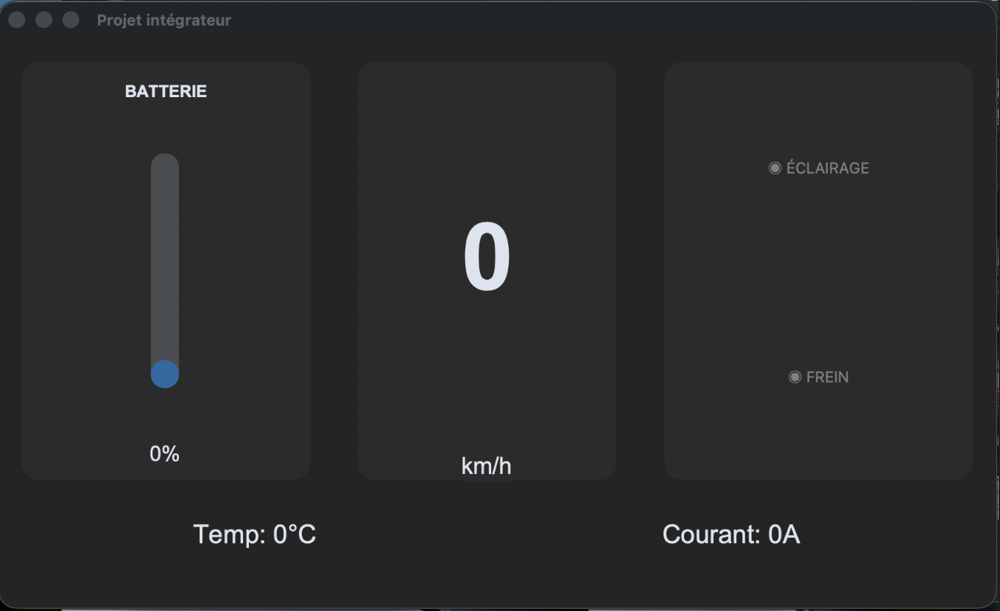

# PROJET INTEGRATEUR

### Introduction

Ce projet a été produit par Roy Jérémy et Meot Arthur en collaboration avec l'équipe professorale du Cégep de Sherbrooke ainsi que le représentant d'Ecomobilité Sherbrooke M.Gauthier. Dans le cadre du programme Technologie du génie électrique : Électronique programmable (243.G0) au Cégep de Sherbrooke.

### But du projet

Ce projet consiste en la conception et l’implémentation d’un tableau de bord embarqué basé sur Raspberry Pi 3, connecté à un écran externe, permettant :

    L’affichage en temps réel des données de la trottinette
    Une interface graphique évoluée
    Une meilleure érgonomie 

### Objectif

Améliorer l’expérience utilisateur en fournissant :

    Une interface claire et intuitive
    Une meilleure sécurité (ex : gestion freinage/accélération)
    Un accès aux informations essentielles du véhicule

## Prérequis

### Matériel

    Trottinette électrique fonctionnelle
    Raspberry Pi 3
    Écran compatible (HDMI)
    Alimentation adaptée (5V pour Raspberry Pi)
    Câble de communication (UART entre contrôleur et Raspberry Pi)

### Logiciel

    Système d’exploitation : Raspberry Pi OS
    Langage de programmation : Python
    Bibliothèques principales :
        tkinter (interface graphique)
        customtkinter (UI plus personnalisable)
        pyserial (communication UART)

    Outils de développement :
        Environnement virtuel Python (venv)
        Éditeur de code (VS Code recommandé)

    Configuration système :
        Activation du port série (UART) sur le Raspberry Pi
        Configuration des permissions d’accès aux ports série

### Limitations

    Temps d'allulage du Raspberry Pi3 long pour un système embarqué
    Sensibilité au vibrations notamment de la carte SD

## Structure

### Schéma

Schéma éléctronique du système complet :

Ce schéma représente le système électronique complet du tableau de bord de la trottinette. Il sert à alimenter, contrôler et faire communiquer les différents éléments.

L’alimentation principale en 12V est d’abord filtrée et protégée, puis convertie en 5V et en 3.3V pour alimenter correctement le microcontrôleur (MCU) et les autres composants. Le MCU constitue le cœur du système : il récupère les données de la trottinette, les traite et les envoie au Raspberry Pi via une communication UART. Le Raspberry Pi s’occupe ensuite de l’affichage sur l’interface graphique.

Le schéma inclut aussi un port USB (alimentation et éventuellement communication), un connecteur STLINK pour programmer et déboguer le microcontrôleur, ainsi que des éléments de support comme les résistances de pull-up pour l’I2C, un bouton reset et des LEDs indiquant la présence des tensions.

### Dossiers/codes

Code du tkinter : 

     import customtkinter as ctk
     import random
     
     ctk.set_appearance_mode("dark")
     ctk.set_default_color_theme("blue")
     
     
     class ScooterDashboard(ctk.CTk):
         def __init__(self):
             super().__init__()
     
             self.title("Projet intégrateur")
             self.geometry("800x480")
     
             #Grille principale 
             self.grid_columnconfigure((0, 1, 2), weight=1)
             self.grid_rowconfigure((0, 1), weight=1)
     
             #Vitesse
             self.speed_frame = ctk.CTkFrame(self, corner_radius=15)
             self.speed_frame.grid(row=0, column=1, padx=20, pady=20, sticky="nsew")
     
             self.lbl_speed = ctk.CTkLabel(self.speed_frame, text="0", font=("Arial", 80, "bold"))
             self.lbl_speed.pack(expand=True)
             ctk.CTkLabel(self.speed_frame, text="km/h", font=("Arial", 20)).pack()
     
             #Batterie 
             self.bat_frame = ctk.CTkFrame(self, corner_radius=15)
             self.bat_frame.grid(row=0, column=0, padx=20, pady=20, sticky="nsew")
     
             ctk.CTkLabel(self.bat_frame, text="BATTERIE", font=("Arial", 14, "bold")).pack(pady=10)
             self.prog_bar = ctk.CTkProgressBar(self.bat_frame, orientation="vertical", width=25)
             self.prog_bar.pack(expand=True, pady=10)
             self.lbl_bat = ctk.CTkLabel(self.bat_frame, text="100%", font=("Arial", 18))
             self.lbl_bat.pack(pady=10)
     
             #Indicateurs
             self.status_frame = ctk.CTkFrame(self, corner_radius=15)
             self.status_frame.grid(row=0, column=2, padx=20, pady=20, sticky="nsew")
     
             self.led_light = ctk.CTkLabel(self.status_frame, text="◉ ÉCLAIRAGE", text_color="gray")
             self.led_light.pack(expand=True)
             self.led_brake = ctk.CTkLabel(self.status_frame, text="◉ FREIN", text_color="gray")
             self.led_brake.pack(expand=True)
     
             #Données Techniques
             self.tech_frame = ctk.CTkFrame(self, corner_radius=15, fg_color="transparent")
             self.tech_frame.grid(row=1, column=0, columnspan=3, padx=20, pady=10, sticky="nsew")
             self.tech_frame.grid_columnconfigure((0, 1), weight=1)
     
             self.lbl_temp = ctk.CTkLabel(self.tech_frame, text="Temp: -- °C", font=("Arial", 22))
             self.lbl_temp.grid(row=0, column=0)
     
             self.lbl_current = ctk.CTkLabel(self.tech_frame, text="Courant: -- A", font=("Arial", 22))
             self.lbl_current.grid(row=0, column=1)
     
             self.update_dashboard()
     
         def update_dashboard(self):
             # Simulation de valeurs
             vitesse = 0
             batterie = 0 # 0%
             temp = 0
             courant = 0
             is_light_on = 0
             is_braking = 0
     
             # Mise à jour de l'affichage
             self.lbl_speed.configure(text=str(vitesse))
             self.prog_bar.set(batterie)
             self.lbl_bat.configure(text=f"{int(batterie * 100)}%")
             self.lbl_temp.configure(text=f"Temp: {temp}°C")
             self.lbl_current.configure(text=f"Courant: {courant}A")
     
             # Mise à jour des couleurs d'état
             self.led_light.configure(text_color="yellow" if is_light_on else "gray")
             self.led_brake.configure(text_color="red" if is_braking else "gray")
    
             self.after(200, self.update_dashboard)
     
     
     if __name__ == "__main__":
         app = ScooterDashboard()
         app.mainloop()

Ce code permet de créer une interface graphique pour le tableau de bord de la trottinette à l’aide de la bibliothèque customtkinter. Il affiche en temps réel des informations comme la vitesse, le niveau de batterie, la température, le courant ainsi que l’état de l’éclairage et du frein.

L’interface est structurée en plusieurs zones : une zone centrale pour la vitesse, une barre verticale pour la batterie, une section d’indicateurs visuels (éclairage et frein) et une zone inférieure pour les données techniques. La fonction update_dashboard() met à jour ces informations de manière automatique toutes les 200 ms. 

Pour l’instant, les valeurs sont simulées, mais elles peuvent être remplacées par des données réelles provenant du microcontrôleur via une communication UART.

Le premier prototype de la disposition de l'écran a donc été crée :

     

### Tests/validation

Implémentation de l’interface graphique sur Raspberry Pi 3 réalisée avec succès malgré plusieurs contraintes techniques :

    Absence initiale de la librairie tkinter sur le système
    Contraintes d’installation de customtkinter nécessitant un environnement virtuel
    Limitations liées aux permissions système du Raspberry Pi

## Utilisation

### Guide utilisation utilisateur

    Allumer la trottinette électrique
    Alimenter le Raspberry Pi 3 (démarrage automatique du tableau de bord)
    Attendre le chargement de l’interface (quelques secondes)
    Visualiser en temps réel :
        La vitesse du véhicule (km/h)
        Le niveau de batterie (%)
        L’état des systèmes (éclairage, frein)
        Les données techniques (température, courant)
    Interagir indirectement via les commandes physiques de la trottinette (accélération, freinage, éclairage)   

### Guide utilisation développeur

    Installer les dépendances nécessaires :
        Ubuntu sur raspberry Pi3
        tkinter
        customtkinter
    Configurer l’environnement virtuel 
    Connecter le Raspberry Pi au contrôleur via UART
    Modifier la fonction update_dashboard() pour remplacer les valeurs simulées par des données réelles recu en UART
    Adapter l’interface graphique selon les besoins :
        Ajout de nouvelles informations
        Modification du design
    Tester en conditions réelles sur la trottinette

### Prochaines étapes à effectuer

    Assemblage du PCB
    Test du PCB
    Implémenter une communication UART
    Fixer le PCB + Raspberry sur un boitier